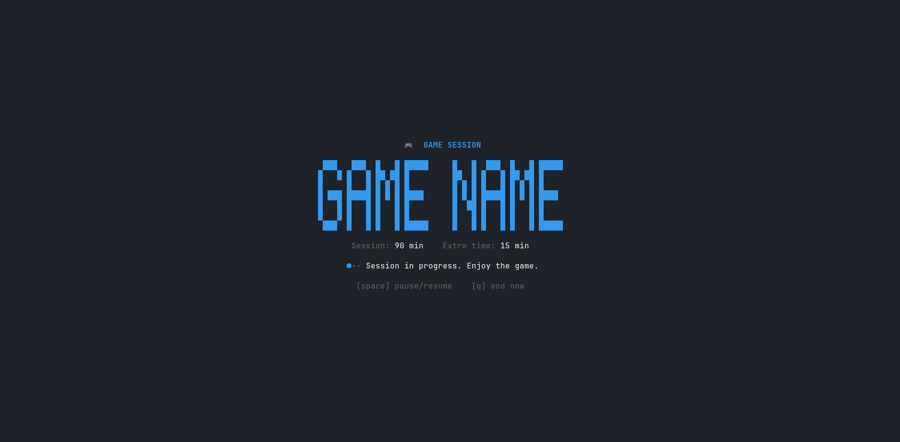

# gametimer

A full-screen TUI game session timer, written in Go.



## Why it exists

`gametimer` is built to help gamers stay in control of their play time, so they can play in a balanced way and enjoy a session without feeling guilty about it afterward.

- **No anxiety during the game.** The main session length is shown once, in full, and never visibly counts down: no countdown timer, no progress bar. Just a discreet spinner indicating the clock is running.
- **Urgency exactly when it's needed.** When the session ends and there's a process configured to auto-close, an "extra time" phase kicks in, and that's when the countdown becomes prominent, because now the goal is to remind you to save before the game closes on its own.

## Installation

### Prebuilt binary (no Go required)

Download the archive for your platform from the [latest release](https://github.com/beckmorr/gametimer/releases/latest), then:

```bash
tar -xzf gametimer_*.tar.gz
cd gametimer_*/
./gametimer --help
# optionally move it onto your PATH:
mv gametimer ~/.local/bin/
```

Linux and macOS only (amd64/arm64). Windows isn't supported: gametimer relies on `pgrep`/POSIX signals to auto-close the game process.

### From source

Requires Go 1.21+.

```bash
go install github.com/beckmorr/gametimer@latest
```

Make sure `$(go env GOPATH)/bin` (usually `~/go/bin`) is on your `PATH`.

### Manual build

```bash
git clone https://github.com/beckmorr/gametimer.git
cd gametimer
go build -o gametimer .
```

## Quick usage

```bash
# first time: set everything
gametimer start "Elden Ring" --process eldenring.exe --session 90 --extra 15 --theme dracula

# next time, just the name (process/session/extra are already saved)
gametimer start "Elden Ring"

# override just what you want for this run (and it updates what's saved)
gametimer start "Elden Ring" --session 45
```

Without `--process`, the session ends with a warning and there's no auto-close, useful for games where you don't want (or can't) kill the process by name.

### Keys during a session

| Key | Action |
|---|---|
| `space` | pause / resume the timer |
| `q` | end the session immediately (logged as cancelled) |
| `enter` / `q` (on the final screen) | quit the TUI |

## Commands

### `gametimer start <game>`

Starts the full-screen timer. Flags:

| Flag | Description |
|---|---|
| `-p, --process` | game process pattern (`pgrep -f`), for auto-close |
| `-s, --session` | session duration in minutes |
| `-e, --extra` | extra time to save, in minutes |
| `-t, --theme` | theme just for this run (doesn't change the default) |

### `gametimer games list` / `gametimer games remove <game>`

Lists or removes saved games (name, monitored process, default durations).

### `gametimer theme list` / `preview <theme>` / `set <theme>`

Lists themes, previews a theme's colors in the terminal, or sets the default theme used when `--theme` isn't passed.

### `gametimer stats [--game <game>] [--period today|week|month|all] [--json]`

Sums up play time from the session log, overall or filtered by game/period.

## Themes

| Name | Style |
|---|---|
| `default` | classic red/green/blue |
| `catppuccin-mocha` | warm pastel |
| `dracula` | dark purple |
| `gruvbox` | retro earthy tones |
| `nord` | arctic minimalism |
| `tokyo-night` | urban neon |
| `solarized` | precision colors |

Each theme defines six semantic colors: `Session` (calm, used during the main session), `Warning` (urgency, used in the extra-time phase), `Success`, `Accent`, `Muted` and `Text`. See `internal/theme/theme.go`.

## How it works under the hood

- **TUI**: [bubbletea](https://github.com/charmbracelet/bubbletea) + [lipgloss](https://github.com/charmbracelet/lipgloss), full screen (alt-screen) with centered content, dashboard-style (LazyVim-like).
- **Auto-close**: uses `pgrep -f`/SIGTERM by process name pattern, like the original bash script. A real gotcha: since `gametimer` itself carries `--process <pattern>` in its own argv, a naive `pgrep -f` search would always "find itself", so `internal/proc` filters out its own PID to avoid a false positive (and a possible self-termination).
- **CLI**: [cobra](https://github.com/spf13/cobra).

## Where the data lives

Following XDG:

- `~/.config/gametimer/config.json`: default theme.
- `~/.config/gametimer/games.json`: saved games.
- `~/.local/share/gametimer/sessions.jsonl`: session log (one JSON line per session: game, process, planned duration, minutes actually played, status). `gametimer stats` reads from here.

## Project structure

```
main.go                              entry point
cmd/                                 cobra commands (start, games, theme, stats)
internal/config/                     config.json + games.json (XDG)
internal/theme/                      theme color palettes
internal/session/                    session JSONL log + stats aggregation
internal/proc/                       game process pgrep/pkill
internal/notify/                     notify-send + paplay (best-effort)
internal/tui/                        bubbletea model (session → extra time → end)
```
